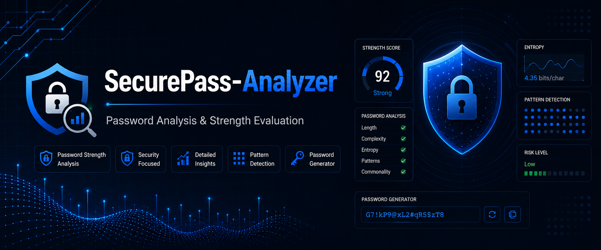
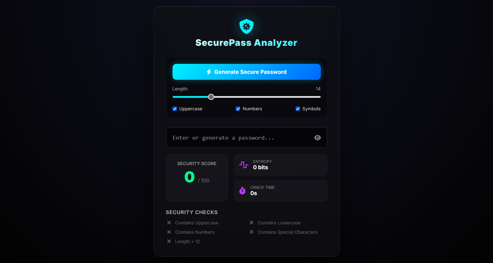

# 🔐 SecurePass Analyzer

A modern password security assessment platform designed to help users create stronger passwords through real-time security analysis, entropy calculation, password generation, and visual security feedback.

SecurePass Analyzer combines modern UI/UX with essential cybersecurity concepts to provide an interactive and educational password security experience.

---

## ✨ Features

* 🔒 Real-time password strength analysis
* 📊 Security score visualization
* 🧠 Password entropy calculation
* ⏱️ Estimated password crack time
* ✅ Password security validation
* 🔑 Secure password generator
* 👁️ Show / Hide password
* 📄 Export security report
* 📱 Fully responsive interface
* 🌙 Modern cybersecurity-inspired UI

---

## 📸 Showcase

### SecurePass Analyzer

---

## 🛠 Technology Stack

### Frontend

* HTML5
* CSS3
* JavaScript (ES6)

### Security Concepts

* Password Entropy
* Password Strength Analysis
* Secure Password Generation
* Crack Time Estimation
* Security Best Practices

---

## 🎯 Project Purpose

SecurePass Analyzer was developed to demonstrate the implementation of password security concepts in an interactive web application.

The project focuses on helping users better understand password strength while showcasing modern frontend development, responsive design, and cybersecurity-oriented user experience.

---

## 🚀 Future Improvements

* Breached password detection
* Password history analysis
* Custom password policies
* Multi-language support
* Advanced security recommendations
* Offline-first support

---

## 👨‍💻 Author

Designed and developed by **Mohamed Soliman**

Software Engineer • Cybersecurity Student

---

## ⚠️ Intellectual Property Notice

SecurePass Analyzer is an original software project created and owned by **Mohamed Soliman**.

The source code, UI/UX design, branding, visual assets, documentation, and project structure are published for portfolio and demonstration purposes only.

Unauthorized copying, redistribution, modification, commercial use, or reproduction of any part of this project is prohibited without prior written permission.

© 2026 Mohamed Soliman. All Rights Reserved.
